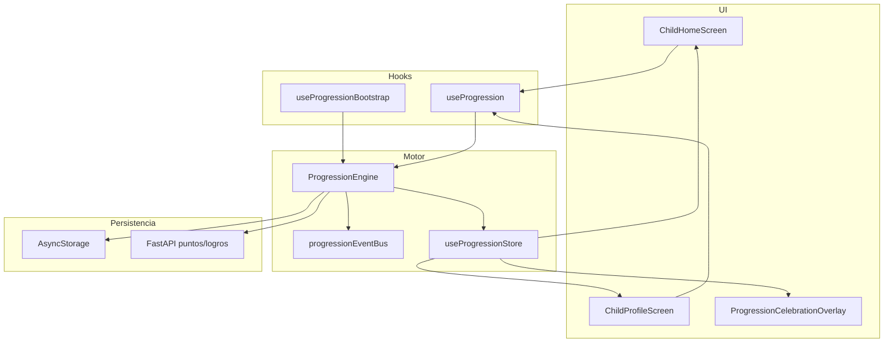

# 08_Gamificacion.md — Motor de Progresión NutriKids

> Depende de: [`03_BaseDatos.md`](./03_BaseDatos.md) §6, [`04_API.md`](./04_API.md), [`07_AppMovil.md`](./07_AppMovil.md) §14–15.
>
> **Implementado:** 2026-07-29 en `NutriKidsMovil/src/features/progresion/`.

---

## 1. Visión

El **Motor de Progresión** es el sistema central de gamificación de NutriKids. Controla XP, niveles, monedas, energía, rachas, logros, insignias, misiones, inventario y mascota. Está diseñado como un **motor de videojuego educativo** reutilizable por cualquier módulo futuro (hábitos, retos, tienda, alimentación, etc.) sin acoplar lógica a pantallas.

Inspiración de diseño: Duolingo (rachas, misiones diarias), Pokémon GO (coleccionables), Habitica (misiones), Finch (mascota emocional), Clash Royale (progresión por niveles).

---

## 2. Arquitectura

### 2.1 Capas (Clean Architecture + Feature First)

```
features/progresion/
├── config/           # Constantes y reglas de negocio configurables
├── types/            # Modelos de dominio y contratos de eventos
├── domain/
│   ├── calculators/  # Funciones puras (XP, racha, energía, mascota)
│   └── factories/    # Construcción de snapshot inicial
├── events/           # Event bus desacoplado
├── repositories/     # Persistencia local + sync API parcial
├── services/         # ProgressionEngine (orquestador) + fachadas
├── store/            # Zustand — estado global de progresión
├── hooks/            # useProgression, useProgressionBootstrap
├── providers/        # ProgressionProvider (bootstrap + overlay)
└── components/       # HUD, dashboard section, celebraciones
```

### 2.2 Flujo de datos



### 2.3 Principios

| Principio | Aplicación |
|---|---|
| **Desacoplamiento** | Pantallas solo consumen `useProgression()`; no calculan XP ni niveles |
| **Single source of truth** | `ProgressionSnapshot` centraliza todo el estado de gamificación |
| **Event-driven** | `progressionEventBus` permite suscribir analytics, push, confeti futuro |
| **Offline-first parcial** | Monedas, energía, rachas e inventario persisten localmente |
| **Sync selectivo** | XP/nivel se sincronizan con `GET /ninos/{id}/puntos`; logros con API |

---

## 3. Modelo central: `ProgressionSnapshot`

| Campo | Tipo | Descripción |
|---|---|---|
| `ninoId` | `number` | ID del niño activo |
| `xp` | `XpState` | Total, nivel, progreso intra-nivel |
| `coins` | `CoinsState` | Balance, historial, lifetime |
| `energy` | `EnergyState` | Energía diaria consumible |
| `streak` | `StreakState` | Racha actual, récord, multiplicador |
| `achievements` | `AchievementState[]` | Logros desbloqueables |
| `badges` | `BadgeState[]` | Insignias con rareza |
| `missions` | `{ daily, weekly, special }` | Misiones por tipo |
| `inventory` | `InventoryItem[]` | Objetos, accesorios, coleccionables |
| `pet` | `PetState` | Mascota: evolución, humor, accesorios |
| `dailyGoal` | `DailyGoalState` | Objetivo del día |
| `nextLevelUnlocks` | `LevelUnlockPreview[]` | Preview de desbloqueos |

---

## 4. Sistemas implementados

### 4.1 Experiencia (XP)

- **Ganar XP:** `progressionEngine.gainXp(snapshot, amount, source, companionEmoji)`
- **Perder XP:** infraestructura en `applyXpDelta` (evento `XP_LOST` reservado)
- **Cálculo de nivel:** `nivel = floor(xpTotal / 100) + 1` — alineado con API FastAPI
- **Progreso intra-nivel:** `xpInLevel = xpTotal % 100`, `xpToNextLevel = 100`
- **Recompensas por nivel:** preview en `nextLevelUnlocks` vía `getNextLevelUnlocks()`

### 4.2 Niveles

| Propiedad | Fuente |
|---|---|
| Nivel actual | `snapshot.xp.currentLevel` |
| Nivel siguiente | `snapshot.xp.nextLevel` |
| XP requerido | `snapshot.xp.xpToNextLevel` (100 por nivel) |
| Desbloqueos | `snapshot.nextLevelUnlocks` |

### 4.3 Monedas

- **Ganancia automática:** ratio `0.5` monedas por XP ganado (`COINS_CONFIG.xpToCoinsRatio`)
- **Gasto:** `progressionEngine.spendCoins(snapshot, amount, source)`
- **Historial:** últimas 50 transacciones en `coins.history`
- **Estado local** hasta columna/endpoints dedicados en API

### 4.4 Energía

- **Máximo:** 100 (`ENERGY_CONFIG.max`)
- **Regeneración diaria:** 100 al cambiar de día (`regenerateDailyEnergy`)
- **Consumo:** misiones (15), hábitos (5) — `consumeEnergy()`
- **Estado local** hasta endpoint API

### 4.5 Rachas

- **Días consecutivos:** `registerStreakActivity()` compara fechas ISO
- **Récord personal:** `streak.best`
- **Bonificación XP:** `1 + (días × 0.05)`, máx. `1.5×` (`STREAK_CONFIG`)

### 4.6 Logros

- Infraestructura: `AchievementState` con categorías (`habitos`, `nutricion`, `retos`, `social`, `especial`)
- Sync parcial desde `GET /ninos/{id}/logros`
- Desbloqueo y recompensas preparados; catálogo semilla en snapshot default

### 4.7 Insignias

- `BadgeState` con rarezas: `common`, `rare`, `epic`, `legendary`
- Semillas: Explorador, Héroe del agua, Amigo verde
- Desbloqueo: `progressionEngine.unlockBadge(snapshot, badgeId)`

### 4.8 Misiones

| Tipo | Ejemplos semilla |
|---|---|
| Diarias | Completar 3 hábitos, Beber agua 4 veces |
| Semanales | Racha de 5 días |
| Especiales | Array vacío — listo para eventos |

- Avance: `progressionEngine.advanceMission(snapshot, missionId, delta, companionEmoji)`
- Al completar: XP + monedas + celebración

### 4.9 Inventario

- `InventoryItem` con tipos: `accessory`, `collectible`, `consumable`, `pet_item`
- Fachada: `inventoryService.list(snapshot)`
- Listo para tienda y recompensas futuras

### 4.10 Mascota

- Integrada con XP/nivel vía `buildPetState()`
- Evolución por umbral de nivel: `egg → baby → kid → teen → hero`
- Estados de humor: `happy`, `neutral`, `sleepy`, `excited`
- Accesorios equipables: `equippedAccessoryIds[]`

---

## 5. Servicios y API pública

### 5.1 ProgressionEngine (orquestador)

| Método | Descripción |
|---|---|
| `initialize(snapshot, companionEmoji)` | Regenera energía, construye mascota, sync remoto |
| `sync(snapshot)` | Sincroniza puntos/logros desde API |
| `gainXp(...)` | XP + monedas + racha + mascota + eventos |
| `spendCoins(...)` | Gasto con validación de balance |
| `consumeEnergy(...)` | Consume energía con regen previa |
| `advanceMission(...)` | Progreso de misión + recompensas |
| `unlockBadge(...)` | Desbloqueo de insignia |
| `updateDailyGoal(...)` | Objetivo del día + bonus XP |
| `persist(snapshot)` | Guarda en AsyncStorage |

### 5.2 Fachadas (`progressionServices.ts`)

`xpService`, `coinsService`, `energyService`, `streakService`, `missionService`, `badgeService`, `petService`, `inventoryService`, `achievementService`

### 5.3 Hooks

```typescript
// Bootstrap automático al entrar en modo niño
const { reload } = useProgressionBootstrap();

// Consumo en pantallas
const { snapshot, gainXp, sync, simulateDailyProgress, celebrations, dequeueCelebration } = useProgression();
```

### 5.4 Export barrel

`features/progresion/index.ts` — punto de entrada único para otros módulos.

---

## 6. Eventos

| Evento | Cuándo se emite |
|---|---|
| `PROGRESSION_INITIALIZED` | Tras `initialize()` |
| `PROGRESSION_SYNCED` | Tras `sync()` |
| `XP_GAINED` | Al ganar XP |
| `LEVEL_UP` | Al subir de nivel |
| `COINS_EARNED` / `COINS_SPENT` | Transacciones de monedas |
| `ENERGY_CONSUMED` | Al gastar energía |
| `STREAK_UPDATED` | Reservado para listeners |
| `MISSION_PROGRESS` / `MISSION_COMPLETED` | Misiones |
| `BADGE_UNLOCKED` | Insignias |
| `DAILY_GOAL_COMPLETED` | Objetivo del día |
| `PET_EVOLVED` / `PET_MOOD_CHANGED` | Reservados |

Suscripción:

```typescript
progressionEventBus.on('LEVEL_UP', (payload) => {
  // analytics, push, confeti...
});
```

---

## 7. Persistencia

| Capa | Clave / Endpoint |
|---|---|
| Local | `@nutrikids/progression/{ninoId}` en AsyncStorage |
| API XP | `GET /api/v1/ninos/{id}/puntos` → `puntos_totales`, `nivel_actual` |
| API logros | `GET /api/v1/ninos/{id}/logros` |
| API hábitos | `POST /api/v1/ninos/{id}/habitos/{id}/registrar` (futuro) |

**Nota:** Monedas, energía, rachas, inventario y misiones son **locales** hasta migraciones API dedicadas (ver `13_Backlog.md` Fase 3).

---

## 8. Reglas de negocio

### XP y nivel

```
XP_PER_LEVEL = 100
currentLevel = floor(totalXp / 100) + 1
xpInLevel = totalXp % 100
progress = xpInLevel / 100
```

### Bonificación por racha

```
multiplier = min(1 + currentStreak × 0.05, 1.5)
xpGained = round(baseAmount × multiplier)
```

### Evolución mascota

| Nivel mínimo | Etapa |
|---|---|
| 0 | egg |
| 2 | baby |
| 5 | kid |
| 10 | teen |
| 20 | hero |

---

## 9. UI integrada

| Componente | Uso |
|---|---|
| `ProgressionHud` | Barra compacta XP/monedas/energía/racha |
| `ProgressionDashboardSection` | Dashboard completo infantil |
| `ProgressionCelebrationOverlay` | Animaciones: subir nivel, XP, monedas, misión, insignia |
| `ProgressionProvider` | Bootstrap + overlay global |

**Pantallas consumidoras:**
- `ChildHomeScreen` — HUD + dashboard + CTA demo
- `ChildProfileScreen` — racha, XP, insignias, logros, mascota

---

## 10. Cómo consumir desde un módulo futuro

```typescript
import { useProgression, missionService, progressionEngine } from '@features/progresion';

function HabitCompletionHandler() {
  const { snapshot, gainXp } = useProgression();

  async function onHabitComplete(habitId: string) {
    if (!snapshot) return;

    const { snapshot: afterEnergy, success } = progressionEngine.consumeEnergy(snapshot, 5);
    if (!success) return;

    const { result, celebrations } = missionService.advance(
      afterEnergy,
      'daily-habits-3',
      1,
      '🦊',
    );

    // Actualizar store y persistir vía hook o engine.persist()
  }
}
```

---

## 11. Deuda técnica / próximos pasos

1. Endpoints API para monedas, energía, rachas, inventario
2. Sync bidireccional XP al registrar hábitos reales (`POST /habitos/.../registrar`)
3. Catálogo de logros/insignias desde `GET /logros-catalogo`
4. Tests unitarios de calculadoras y E2E del ciclo hábito→XP
5. Confeti avanzado (Lottie) en celebraciones
6. Anti-cheat: validación server-side de transacciones

---

## 12. Verificación

```powershell
cd NutriKidsMovil
npm.cmd run typecheck   # debe pasar sin errores
```

**Prueba manual:** Modo demo → login padre → "🎮 Modo niño" → "Comenzar aventura del día" → ver XP, misiones y celebraciones.

### 12.1 Integración hábitos (T4.5)

El módulo `features/habitos/services/habitProgressionBridge.ts` es el punto de enganche oficial:

```typescript
// Tras POST /habitos/.../registrar
await habitProgressionBridge.onHabitToggled(snapshot, habito, true, wasCompleted, companionEmoji);
```

Métodos añadidos al engine:
- `applyHabitSideEffects()` — misiones, objetivo diario, mascota
- `addCoinsReward()` — monedas cuando XP viene del servidor
