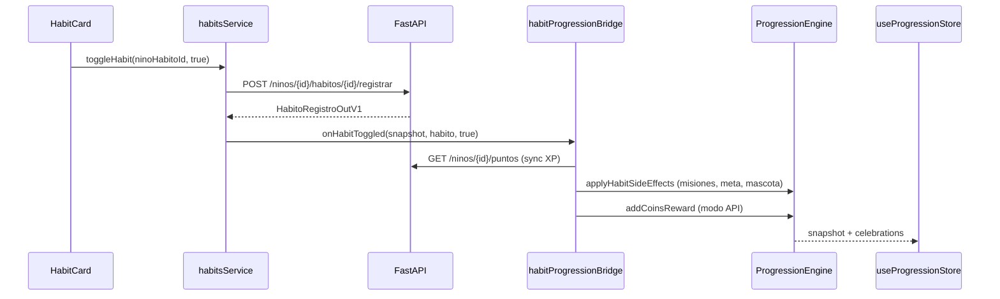

# 09_HabitosSaludables.md — Sistema Inteligente de Hábitos Saludables

> Depende de: [`04_API.md`](./04_API.md), [`08_Gamificacion.md`](./08_Gamificacion.md), [`07_AppMovil.md`](./07_AppMovil.md) §15–16.
>
> **Implementado:** 2026-07-29 en `NutriKidsMovil/src/features/habitos/`.

---

## 1. Visión

El **Sistema Inteligente de Hábitos Saludables** enseña hábitos positivos mediante gamificación intrínseca. No utiliza castigos, no genera ansiedad ni afecta la autoestima infantil.

Principios de diseño:
- **Solo recompensas positivas** al completar hábitos
- **Desmarcar un hábito no resta puntos** ni muestra mensajes negativos
- **Mascota siempre alentadora**, nunca culpabilizadora
- **Metas adaptadas por edad**, configurables por padre/profesional (futuro)

---

## 2. Arquitectura

```
features/habitos/
├── config/              # Emojis, mensajes positivos, recomendaciones por edad
├── types/               # Modelos de dominio
├── domain/calculators/  # Estadísticas, calendario, recomendaciones edad
├── repositories/        # API + AsyncStorage (historial local)
├── services/
│   ├── habitsService.ts           # Casos de uso CRUD/registro
│   └── habitProgressionBridge.ts  # Integración Motor de Progresión
├── store/               # Zustand — estado hábitos + reacción mascota
├── hooks/               # useHabits, useHabitCalendar, useHabitStatistics
├── components/          # 8 componentes reutilizables
└── screens/             # HabitsHome, HabitCalendar, HabitStatistics
```

### Flujo al completar un hábito



---

## 3. Hábitos soportados

| Hábito | Categoría | Puntos base |
|---|---|---|
| Beber agua | alimentacion | 10 |
| Comer verduras | alimentacion | 15 |
| Comer frutas | alimentacion | 12 |
| Actividad física | actividad | 20 |
| Dormir bien | sueno | 10 |
| Lavarse las manos | higiene | 5 |
| Descanso de pantallas | actividad | 8 |

Catálogo desde `GET /api/v1/habitos-catalogo` o semilla demo local.

---

## 4. Endpoints API utilizados

| Método | Ruta | Uso |
|---|---|---|
| `GET` | `/api/v1/habitos-catalogo` | Catálogo de hábitos |
| `GET` | `/api/v1/ninos/{id}/habitos` | Hábitos asignados al niño |
| `POST` | `/api/v1/ninos/{id}/habitos` | Asignar hábito (auto al primer load) |
| `POST` | `/api/v1/ninos/{id}/habitos/{id}/registrar` | Registrar cumplimiento |
| `GET` | `/api/v1/ninos/{id}/puntos` | Sync XP tras completar (via bridge) |

**Nota:** No existe endpoint de historial de registros — se persiste localmente en AsyncStorage (`@nutrikids/habitos/{ninoId}`).

---

## 5. Integración con Motor de Progresión

| Acción | Mecanismo |
|---|---|
| XP | API suma `puntos_base` → bridge sincroniza con `mergeSnapshotWithApiPuntos` |
| Monedas | `progressionEngine.addCoinsReward()` (modo API) o `gainXp()` (demo) |
| Misiones | `progressionEngine.applyHabitSideEffects()` → `daily-habits-3`, `daily-water` |
| Racha | `registerStreakActivity()` vía `gainXp` (demo) o stats locales |
| Objetivo diario | `updateDailyGoal(+1)` en side effects |
| Mascota | Mood `excited` + mensajes positivos via `PetReactionCard` |

**Sin duplicación:** el bridge evita llamar `gainXp` cuando la API ya aplicó XP.

---

## 6. Componentes reutilizables

| Componente | Propósito |
|---|---|
| `HabitCard` | Tarjeta de hábito con checkbox accesible |
| `DailyHabitTracker` | Lista diaria + barra de progreso |
| `ProgressCalendar` | Calendario mensual con días completados |
| `PetReactionCard` | Mascota con mensajes positivos y animación |
| `RewardAnimation` | Modal de celebración local |
| `HealthyActionButton` | CTA grande accesible |
| `WeeklyProgressCard` | Resumen semanal amigable |
| `StatisticsCard` | Métrica individual para dashboard stats |

---

## 7. Pantallas

| Pantalla | Ruta stack | Descripción |
|---|---|---|
| `HabitsHomeScreen` | `HabitsHome` | Tracker diario + mascota + acciones |
| `HabitCalendarScreen` | `HabitCalendar` | Calendario + racha |
| `HabitStatisticsScreen` | `HabitStatistics` | Gráficos simples + métricas |

**Acceso:** Tab "Más" → Mis Hábitos; Dashboard infantil → "Comenzar aventura" / "Ver mis hábitos".

---

## 8. Reglas de negocio

### Completar hábito
- Solo genera recompensas la **primera vez** que se marca completado en el día
- Desmarcar: mensaje neutro/alentador, **sin penalización**

### Recomendaciones por edad
| Edad | Meta diaria sugerida |
|---|---|
| 3–5 | 2 hábitos |
| 6–8 | 3 hábitos |
| 9–11 | 4 hábitos |
| 12–17 | 5 hábitos |

### Mensajes de mascota
- 0% completado: saludo motivador
- >0%: "¡Buen comienzo!"
- ≥50%: "¡Vas muy bien!"
- 100%: "¡Completaste todos tus hábitos!"

---

## 9. Decisiones UX

1. **Sin rojo ni alertas** — colores mint/sunshine para éxito
2. **Botones ≥52px** de altura — accesibilidad infantil
3. **Checkbox grande (40px)** — fácil de tocar
4. **Frase final en estadísticas:** "no se trata de ser perfecto"
5. **Pull-to-refresh** en pantalla principal

---

## 10. Modo demo

Con `EXPO_PUBLIC_DEMO_MODE=true`:
- Catálogo y registros en AsyncStorage
- Auto-asignación de 5 hábitos al primer acceso
- XP via `gainXp` local (sin API)

---

## 11. Deuda técnica / futuro

1. Endpoint API para historial de registros (`GET /habitos/registros`)
2. Configuración de hábitos por padre/nutriólogo desde panel familiar
3. Sincronización de misiones con API (actualmente locales en motor)
4. Edición de registros de días anteriores con validación server-side
5. Tests E2E ciclo hábito → XP → celebración

---

## 12. Verificación

```powershell
cd NutriKidsMovil
npm.cmd run typecheck
```

**Prueba manual:** Modo demo → Modo niño → Mis Hábitos → marcar hábito → ver celebración + mascota + HUD actualizado.
