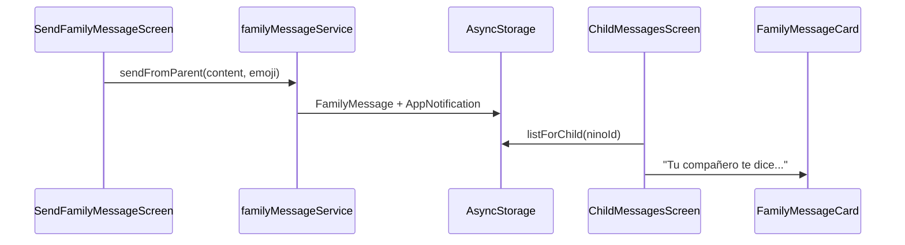

# 10_Comunicacion.md — Sistema Inteligente de Comunicación y Acompañamiento

> Depende de: [`08_Gamificacion.md`](./08_Gamificacion.md), [`09_HabitosSaludables.md`](./09_HabitosSaludables.md), [`07_AppMovil.md`](./07_AppMovil.md) §17.
>
> **Implementado:** 2026-07-29 en `NutriKidsMovil/src/features/comunicacion/`.

---

## 1. Visión

Plataforma de **interacción positiva** entre padre, niño, mascota virtual y (futuro) profesional de salud. No es un sistema de alertas clínicas ni de presión — refuerza hábitos, motivación y vínculo familiar.

Principios:
- **Nunca culpa, presión ni ansiedad**
- Mensajes validados como positivos antes de enviar (padre → niño)
- Entrega infantil vía **mascota virtual**
- Push provider-agnostic (`PushProvider` interface)

---

## 2. Arquitectura

```
features/comunicacion/
├── config/           # Plantillas, recordatorios, campañas, validación positiva
├── types/            # AppNotification, FamilyMessage, ReminderConfig, Campaign
├── domain/
│   ├── factories/    # createNotification
│   └── validators/   # isPositiveMessage
├── push/
│   ├── PushProvider.interface.ts   # Contrato intercambiable (Expo/FCM)
│   └── ExpoPushProvider.ts         # Implementación actual
├── repositories/     # AsyncStorage + API stub
├── services/
│   ├── communicationServices.ts  # notificationCenter, familyMessage, campaign
│   ├── reminderService.ts
│   └── communicationEventBridge.ts # progressionEventBus → notificaciones
├── store/            # useCommunicationStore
├── hooks/            # useNotificationCenter, useFamilyMessaging, useReminders
├── providers/        # CommunicationProvider
├── components/       # 6 tarjetas reutilizables
└── screens/          # 4 pantallas
```

### Flujo padre → niño



---

## 3. Categorías de notificaciones

| Categoría | Origen | Ejemplo |
|---|---|---|
| `logro` | Motor progresión (event bus) | Subir de nivel, insignia |
| `habito` | Motor progresión | Objetivo del día |
| `reto` | Motor progresión | Misión completada |
| `recompensa` | Motor progresión | Monedas ganadas |
| `recordatorio` | reminderService | Hidratación, sueño |
| `familiar` | familyMessageService | Mensaje del padre |
| `evento` | campaignService | Semana de la salud |
| `profesional` | Reservado | Nutriólogo (futuro) |

---

## 4. Comunicación padre → niño

### Capacidades del padre (`SendFamilyMessageScreen`)

- Felicitaciones rápidas (plantillas predefinidas)
- Mensaje personalizado (validado como positivo)
- Recompensas virtuales (estrella, trofeo, arcoíris)

### Entrega al niño

- `ChildMessagesScreen` muestra mensajes vía `FamilyMessageCard`
- Prefijo: *"Tu compañero te dice:"*
- También aparece en `NotificationCenterScreen` categoría `familiar`

### Validación positiva

Patrones prohibidos: culpa, castigo, presión corporal (`NEGATIVE_PATTERNS` en config).

---

## 5. Recordatorios inteligentes

| Tipo | Hora default | Mensaje |
|---|---|---|
| Hidratación | 10:00 | Positivo, sin presión |
| Alimentación | 12:30 | Nutrición amigable |
| Actividad | 16:00 | Movimiento divertido |
| Sueño | 20:30 | Descanso saludable |
| Misiones | 17:00 | Invitación lúdica |

- Configurables en `RemindersSettingsScreen`
- Programación local via `ExpoPushProvider.scheduleLocalNotification`
- Toggle on/off por recordatorio

---

## 6. Infraestructura Push

### Contrato `PushProvider`

```typescript
interface PushProvider {
  requestPermissions(): Promise<boolean>;
  getDeviceToken(): Promise<string | null>;
  scheduleLocalNotification(notification): Promise<string>;
  cancelScheduledNotification(id): Promise<void>;
  onNotificationReceived(callback): () => void;
}
```

### Implementación actual

- **Expo Notifications** (`expo-notifications@57`)
- Registro token → `POST /dispositivos/registrar-token` (stub — endpoint futuro)
- Sustituible por FCM sin cambiar servicios de negocio

### Legacy

`src/services/notifications/index.ts` reexporta la nueva implementación.

---

## 7. Eventos y campañas

Infraestructura en `campaignService` + semillas:

- Semana de la Salud (semanal)
- Reto Familiar (familiar)
- Regreso a Clases (escolar)

Extensible: añadir campañas en config sin modificar pantallas.

---

## 8. Pantallas

| Pantalla | Audiencia | Ruta |
|---|---|---|
| `NotificationCenterScreen` | Niño | `NotificationCenter` |
| `ChildMessagesScreen` | Niño | `ChildMessages` |
| `RemindersSettingsScreen` | Niño | `RemindersSettings` |
| `SendFamilyMessageScreen` | Padre | `SendFamilyMessage` |

**Acceso niño:** Más → Notificaciones / Mensajes  
**Acceso padre:** Perfil del hijo → Enviar mensaje positivo

---

## 9. Integración automática

`CommunicationProvider` (en `AppProviders`):

1. Suscripción a `progressionEventBus` (LEVEL_UP, BADGE, MISSION, DAILY_GOAL, COINS)
2. Inicialización push + registro token
3. Programación recordatorios habilitados

---

## 10. Persistencia

| Dato | Almacenamiento |
|---|---|
| Notificaciones | AsyncStorage `@nutrikids/comunicacion/{ninoId}` |
| Mensajes familiares | Mismo |
| Recordatorios | Mismo |
| Campañas | Mismo |
| Token push | Registro API (cuando exista endpoint) |

---

## 11. Componentes reutilizables

| Componente | Uso |
|---|---|
| `NotificationCard` | Item del centro de notificaciones |
| `ReminderCard` | Toggle recordatorio |
| `FamilyMessageCard` | Mensaje del padre vía mascota |
| `EventCard` | Campaña/evento activo |
| `RewardMessageCard` | Confirmación de envío/recompensa |
| `PushNotificationPreview` | Vista previa estilo sistema |

---

## 12. Deuda técnica / futuro

1. Endpoints API: `mensajes`, `notificaciones`, `dispositivos/registrar-token`
2. Mensajes nutriólogo → padre/niño (categoría `profesional`)
3. Worker backend para push remoto (FCM/APNs)
4. Badge unread en tab bar
5. Sincronización multi-dispositivo

---

## 13. Verificación

```powershell
cd NutriKidsMovil
npm.cmd run typecheck
```

**Prueba manual:**
1. Padre → perfil hijo → Enviar mensaje → plantilla
2. Modo niño → Más → Mensajes → ver mensaje vía mascota
3. Completar hábito → Notificaciones → ver log automático
