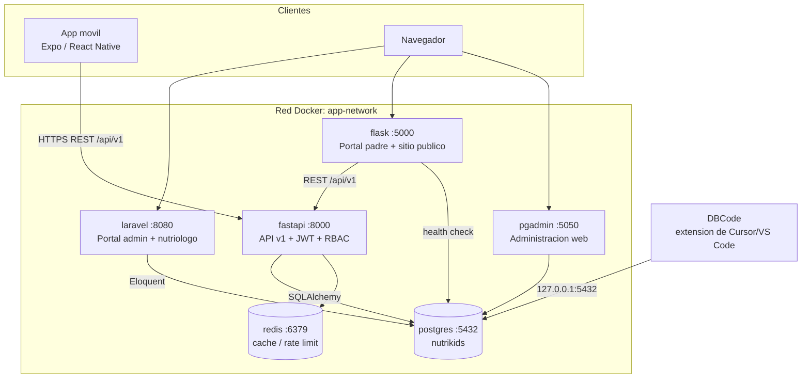
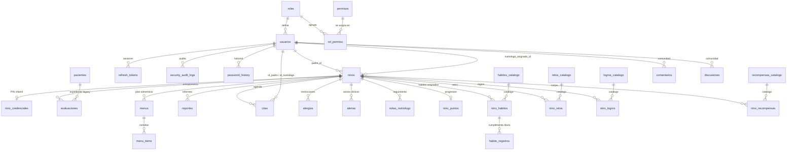

# Infraestructura de datos — PostgreSQL, pgAdmin y DBCode

**Última actualización:** 2026-07-30
**Motor oficial:** PostgreSQL 15 (contenedor `nutrikids_postgres`)

PostgreSQL es la **única fuente de datos** de NutriKids. Los tres backends
(Laravel, FastAPI y Flask) y la aplicación móvil leen y escriben en la misma base
`nutrikids`; no existe ningún almacén paralelo ni datos simulados en producción.

---

## 1. Arquitectura Docker

### Servicios

| Servicio | Contenedor | Imagen | Puerto host | Acceso a la base |
|----------|-----------|--------|-------------|------------------|
| `postgres` | `nutrikids_postgres` | `postgres:15-alpine` | `127.0.0.1:5432` | — (es la base) |
| `pgadmin` | `nutrikids_pgadmin` | `dpage/pgadmin4:8.14` | `5050` | Administración web |
| `redis` | `nutrikids_redis` | `redis:7-alpine` | interno | Caché y rate limiting |
| `fastapi` | `nutrikids_fastapi` | build local | `8000` | SQLAlchemy + Alembic |
| `laravel` | `nutrikids_laravel` | build local | `8080` | Eloquent + migraciones |
| `flask` | `nutrikids_flask` | build local | `5000` | SQLAlchemy (sólo `/health/db`) |

Todos comparten la red bridge `app-network`, por lo que se resuelven entre sí por
nombre de servicio (`postgres`, `fastapi`, …) sin exponer puertos innecesarios.

### Diagrama de servicios



### Persistencia

| Volumen | Contenido | Consecuencia de borrarlo |
|---------|-----------|--------------------------|
| `postgres_data` | Datos de la base | Pérdida total de información clínica |
| `pgadmin_data` | Servidores, preferencias y contraseñas guardadas de pgAdmin | Hay que reconfigurar pgAdmin |
| `redis_data` | Caché y contadores de rate limiting | Sin impacto en datos de negocio |

---

## 2. Modelo entidad-relación

El esquema tiene 43 tablas. El diagrama muestra el núcleo clínico y de
gamificación; los detalles completos de columnas están en
[`diccionario-datos.md`](diccionario-datos.md).



### Dominios funcionales

| Dominio | Tablas |
|---------|--------|
| Identidad y RBAC | `usuarios`, `roles`, `permisos`, `rol_permiso`, `refresh_tokens`, `password_history`, `password_reset_tokens`, `login_attempts` |
| Perfiles infantiles | `ninos`, `nino_credenciales`, `alergias` |
| Clínico | `evaluaciones`, `menus`, `menu_items`, `menus_semanales`, `reportes`, `notas_nutriologo`, `alertas`, `pacientes` |
| Agenda | `citas` |
| Gamificación | `habitos_catalogo`, `nino_habitos`, `habito_registros`, `retos_catalogo`, `nino_retos`, `logros_catalogo`, `nino_logros`, `recompensas_catalogo`, `nino_recompensas`, `nino_puntos` |
| Comunidad | `discusiones`, `comentarios`, `contactos` |
| Auditoría | `security_audit_logs` |
| Infraestructura Laravel | `cache`, `cache_locks`, `jobs`, `job_batches`, `failed_jobs`, `sessions`, `migrations` |
| Control de versiones de esquema | `alembic_version`, `migrations` |

### Notas de diseño

- **Normalización.** El esquema está en 3FN: los catálogos (`habitos_catalogo`,
  `retos_catalogo`, `logros_catalogo`, `recompensas_catalogo`) están separados de
  las asignaciones por niño, y los permisos se resuelven por la tabla puente
  `rol_permiso` en vez de duplicarse en `usuarios`.
- **`ninos` vs `pacientes`.** `ninos` es la entidad canónica (API v1 y móvil).
  `pacientes` es el expediente heredado del portal nutriólogo; `evaluaciones`,
  `menus` y `reportes` mantienen ambas claves foráneas durante la convivencia.
  La unificación está pendiente y documentada como riesgo.
- **`infantes`.** Tabla vacía sin modelo activo, residuo de una migración
  temprana de Laravel. Se conserva para no romper el historial de migraciones;
  no debe usarse en código nuevo.
- **Borrado lógico.** `ninos.deleted_at` permite soft delete; las consultas de la
  API filtran por `deleted_at IS NULL`.

### Integridad declarada en la base

Migración `20260730_0009_indices_integridad`:

- **19 índices** sobre columnas de clave foránea que PostgreSQL no indexa solo.
  Sin ellos cada borrado en la tabla padre provoca un recorrido secuencial.
- **7 índices compuestos** alineados con las consultas reales (agenda por
  nutriólogo, citas por padre, auditoría por fecha, cumplimiento de hábitos).
- **10 restricciones CHECK** que impiden datos clínicamente imposibles:
  pesos y tallas no positivos, IMC no positivo, percentiles fuera de 0–100,
  puntos negativos, y valores de `estado`/`franja` fuera del dominio.

Verificación: `sql/diagnostico_integridad.sql`.

---

## 3. Variables de entorno

Todas las credenciales viven en `.env` (ignorado por git). La plantilla
documentada es `.env.example`.

| Variable | Servicio | Obligatoria | Descripción |
|----------|----------|-------------|-------------|
| `POSTGRES_DB` | postgres, laravel, fastapi | no (`nutrikids`) | Nombre de la base |
| `POSTGRES_USER` | postgres, laravel, fastapi | no (`nutrikids_user`) | Rol propietario |
| `POSTGRES_PASSWORD` | postgres, laravel, fastapi | **sí** | Compose falla si no está definida |
| `DB_CONNECTION` / `DB_HOST` / `DB_PORT` / `DB_DATABASE` / `DB_USERNAME` / `DB_PASSWORD` | laravel | sí | Compose las sobrescribe apuntando a `postgres` |
| `NUTRIKIDS_DATABASE_URL` | fastapi | **sí** | URL SQLAlchemy; la API se niega a arrancar sin ella |
| `NUTRIKIDS_REDIS_URL` | fastapi | no | Caché y rate limiting |
| `SQLALCHEMY_DATABASE_URI` | flask | no | Sólo habilita `/health/db` |
| `NUTRIKIDS_SECRET_KEY` | fastapi | **sí** | Firma de los JWT; mínimo 32 caracteres o la API aborta |
| `FLASK_SECRET_KEY` | flask | **sí** | Firma de cookies de sesión; mínimo 32 caracteres o Flask aborta |
| `FLASK_SHOW_DEMO_CREDENTIALS` | flask | no (`false`) | Muestra el recuadro de credenciales de demo en `/login` |
| `PGADMIN_DEFAULT_EMAIL` | pgadmin | no (`admin@nutrikids.com`) | Usuario de acceso a la consola |
| `PGADMIN_DEFAULT_PASSWORD` | pgadmin | **sí** | Compose falla si no está definida |
| `PGADMIN_PORT` | pgadmin | no (`5050`) | Puerto publicado en el host |
| `ADMIN_TEMPORAL_EMAIL` / `ADMIN_TEMPORAL_PASSWORD` | laravel | no | Sólo para recuperar el acceso al panel; retirar tras usarlas |

Ningún archivo versionado contiene contraseñas reales: las plantillas
(`.env.example`, `.env.laravel`, `.env.flask`, `fastapi/.env.example`) usan
marcadores del tipo `cambia-esta-contrasena` o `CAMBIAR`.

Las claves de firma no tienen valor por defecto a propósito. Un default
publicado en el repositorio permitiría a cualquiera emitir JWT válidos o
falsificar cookies de sesión, así que tanto FastAPI como Flask abortan el
arranque si la clave falta o tiene menos de 32 caracteres. Genera una con:

```bash
python -c "import secrets; print(secrets.token_urlsafe(48))"
```

---

## 4. Procedimientos

### 4.1 Levantar PostgreSQL

```bash
cp .env.example .env          # sólo la primera vez; define POSTGRES_PASSWORD
docker compose up -d postgres
docker compose ps postgres    # debe decir (healthy)
```

Aplicar el esquema (ambos motores de migración sobre la misma base):

```bash
docker compose exec fastapi alembic upgrade head
docker compose exec laravel php artisan migrate --force
```

Comprobar la conexión desde cada servicio:

```bash
docker compose exec laravel php artisan db:show        # driver pgsql, host postgres
curl http://localhost:8000/health                      # "database": "ok"
curl http://localhost:5000/health/db                   # "database": "postgresql"
```

### 4.2 Levantar pgAdmin

```bash
docker compose up -d pgadmin
```

Abrir <http://localhost:5050> e iniciar sesión con `PGADMIN_DEFAULT_EMAIL` y
`PGADMIN_DEFAULT_PASSWORD`.

El servidor **NutriKids PostgreSQL** aparece precargado desde
`docker/pgadmin/servers.json` (grupo `NutriKids`). Por diseño el archivo **no
contiene la contraseña**: pgAdmin la pide en la primera conexión y, si marcas
*Save password*, queda cifrada dentro del volumen `pgadmin_data`.

> Desde pgAdmin el host de la base es `postgres` y el puerto `5432`, porque la
> conexión ocurre dentro de la red Docker, no desde el host.

### 4.3 Conectar DBCode

El workspace incluye `.vscode/settings.json` con la conexión
`NutriKids PostgreSQL (local)` apuntando a `127.0.0.1:5432`. Al abrir el proyecto,
DBCode la detecta automáticamente.

Pasos manuales en la interfaz de Cursor/VS Code:

1. Abrir el panel **DBCode** en la barra lateral.
2. Seleccionar la conexión **NutriKids PostgreSQL (local)**.
3. Al conectar por primera vez, introducir el valor de `POSTGRES_PASSWORD`.
   Con `savePassword: secretStorage`, se guarda en el almacén de secretos del
   sistema operativo y no toca el repositorio.
4. Expandir `nutrikids` → `public` para explorar tablas, vistas y relaciones.
5. Para ejecutar scripts: abrir un archivo `.sql` (por ejemplo
   `sql/diagnostico_integridad.sql`) y lanzarlo contra la conexión seleccionada.

Si el puerto 5432 no responde desde el host, confirma que
`docker compose ps postgres` publica `127.0.0.1:5432->5432/tcp`.

### 4.4 Respaldos y restauración

Crear un respaldo (genera `.dump` para restauración selectiva y `.sql.gz` legible):

```bash
./scripts/backup_postgres.sh            # Linux / macOS / WSL
```

```powershell
./scripts/db/backup.ps1                 # Windows
./scripts/db/backup.ps1 -Formato plain  # variante .sql
```

Restaurar:

```bash
./scripts/db/restore_postgres.sh ./backups/nutrikids_AAAAMMDD_HHMMSS.dump --clean
```

```powershell
./scripts/db/restore.ps1 -Archivo ./backups/nutrikids_AAAAMMDD_HHMMSS.dump -Limpiar
```

Después de restaurar, alinear el esquema con el código:

```bash
docker compose exec fastapi alembic upgrade head
docker compose exec laravel php artisan migrate --force
```

Los respaldos contienen datos clínicos reales: `.gitignore` excluye `/backups/`,
`*.dump` y `*.sql.gz`. No los adjuntes a issues ni los subas a almacenamiento
compartido sin cifrar.

### 4.5 Instalación limpia

```bash
# 1. Configuración
cp .env.example .env
# editar .env: POSTGRES_PASSWORD, FLASK_SECRET_KEY, PGADMIN_DEFAULT_PASSWORD

# 2. Construir y levantar
docker compose build
docker compose up -d

# 3. Esquema
docker compose exec fastapi alembic upgrade head
docker compose exec laravel php artisan migrate --force

# 4. Datos iniciales (roles, permisos, catálogos y usuarios de acceso)
docker compose exec laravel php artisan db:seed --force
docker compose exec fastapi python seed.py

# 5. Clave de aplicación Laravel (sólo si APP_KEY está vacía)
docker compose exec laravel php artisan key:generate

# 6. Verificación
docker compose ps
curl http://localhost:8000/health
curl http://localhost:5000/health/db
curl http://localhost:8080/up
```

Para empezar desde cero **borrando los datos existentes**:

```bash
docker compose down -v      # elimina postgres_data, pgadmin_data y redis_data
```

### 4.6 Diagnóstico del esquema

```powershell
Get-Content sql/diagnostico_integridad.sql | docker compose exec -T postgres psql -U nutrikids_user -d nutrikids -f -
```

Informa de claves foráneas sin índice, restricciones CHECK activas, volumen por
tabla, índices sin uso, huérfanos lógicos y estado de ambas cadenas de migración.

Regenerar el diccionario de datos tras cualquier cambio de esquema:

```powershell
./scripts/db/generar-diccionario.ps1
```

---

## 5. Datos iniciales

Los seeders cargan únicamente **datos de configuración**, no datos clínicos
ficticios:

| Origen | Contenido |
|--------|-----------|
| `RolesPermisosSeeder` | 4 roles (`admin`, `nutriologo`, `padre`, `nino`) y 19 permisos |
| `CredencialesSeeder` | Usuarios de acceso por rol (ver `docs/credenciales-temporales.md`) |
| `fastapi/seed.py` | Catálogos de hábitos, retos, logros y recompensas |

Las tablas clínicas (`ninos`, `evaluaciones`, `menus`, `reportes`, `citas`)
arrancan vacías: se pueblan exclusivamente con información real capturada desde
los portales o la app móvil.

### Contenido de demostración

`UsuarioSeeder`, `ComentarioSeeder` y `DiscusionSeeder` insertaban personas,
comentarios y discusiones ficticias, y se ejecutaban en cada `db:seed`. Ahora
están agrupados en `DemoContenidoSeeder`, fuera del sembrado por defecto y
bloqueado en `production`:

```bash
# Sólo en desarrollo local, de forma explícita
docker compose exec laravel php artisan db:seed --class=DemoContenidoSeeder
```

Una instalación limpia queda sin un solo registro ficticio en la base.

---

## 6. Referencias

- [`diccionario-datos.md`](diccionario-datos.md) — todas las columnas, tipos y claves
- [`docker.md`](docker.md) — despliegue general del stack
- [`integracion-estabilizacion-fase.md`](integracion-estabilizacion-fase.md) — integración entre módulos
- [`credenciales-temporales.md`](credenciales-temporales.md) — usuarios de prueba por rol
- `sql/diagnostico_integridad.sql` — auditoría del esquema
- `fastapi/alembic/versions/` — historial de migraciones de la API
- `database/migrations/` — historial de migraciones de Laravel
